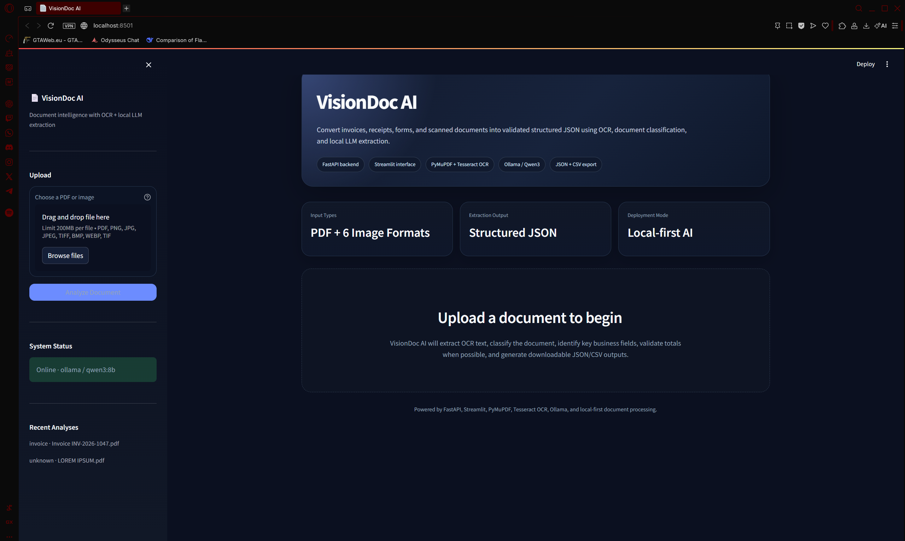

# VisionDoc AI — Intelligent Document Understanding Platform

VisionDoc AI is a local-first document intelligence application that converts invoices, receipts, forms, bank statements, contracts, and scanned documents into structured JSON using OCR and LLM-based extraction.

It is designed as an AI Engineer portfolio project that demonstrates document ingestion, OCR processing, structured extraction, validation, API design, and a polished full-stack user interface.

---

## Demo Preview

Add screenshots after running the app:

```text
assets/home.png
assets/extraction.png
assets/json-output.png
```

Example README image syntax:

```markdown

```

---

## Key Features

- Upload PDFs and image documents: `.pdf`, `.png`, `.jpg`, `.jpeg`, `.tiff`, `.bmp`, `.webp`
- Extract text using PyMuPDF native PDF parsing and Tesseract OCR fallback
- Classify document type as invoice, receipt, form, bank statement, contract, ID document, or unknown
- Extract structured fields such as vendor, customer, document number, date, due date, subtotal, tax, total, currency, and line items
- Validate invoice/receipt arithmetic when subtotal, tax, and total are available
- Export analysis results as JSON or CSV
- Store analyzed outputs locally as JSON records
- Run fully locally using Ollama and Qwen3, with optional OpenAI support
- Clean Streamlit interface with a FastAPI backend

---

## Architecture

```text
Document Upload
      ↓
FastAPI /documents/analyze
      ↓
PDF Text Extraction or Image OCR
      ↓
Text Normalization
      ↓
LLM Extraction Prompt
      ↓
Structured JSON Response
      ↓
Validation + Local JSON Storage
      ↓
Streamlit Results Dashboard
```

---

## Tech Stack

| Layer | Tools |
|---|---|
| Frontend | Streamlit |
| Backend | FastAPI, Uvicorn |
| OCR | PyMuPDF, Tesseract, Pillow |
| LLM | Ollama / Qwen3-8B, optional OpenAI |
| Data Handling | Pydantic, Pandas, JSON |
| Storage | Local JSON files |

---

## Project Structure

```text
VisionDoc_AI/
├── backend/
│   ├── api/
│   │   ├── documents.py
│   │   └── health.py
│   ├── core/
│   │   ├── config.py
│   │   └── llm_client.py
│   ├── models/
│   │   └── schemas.py
│   ├── storage/
│   │   └── document_store.py
│   ├── utils/
│   │   ├── ocr.py
│   │   └── validators.py
│   └── main.py
├── frontend/
│   └── app.py
├── data/
│   ├── uploads/
│   └── outputs/
├── .streamlit/
│   └── config.toml
├── .env.example
├── .gitignore
├── requirements.txt
└── README.md
```

---

## Setup Instructions

### 1. Clone the repository

```bash
git clone https://github.com/YOUR_USERNAME/VisionDoc_AI.git
cd VisionDoc_AI
```

### 2. Create a virtual environment

```bash
python -m venv .venv
```

Windows PowerShell:

```powershell
.\.venv\Scripts\Activate.ps1
```

macOS/Linux:

```bash
source .venv/bin/activate
```

### 3. Install Python dependencies

```bash
pip install -r requirements.txt
```

### 4. Install Tesseract OCR

VisionDoc AI requires the Tesseract OCR engine.

Verify installation:

```bash
tesseract --version
```

On Windows, install Tesseract and make sure `tesseract.exe` is available in PATH.

### 5. Configure environment variables

```bash
copy .env.example .env
```

For Ollama/local inference:

```env
LLM_PROVIDER=ollama
OLLAMA_BASE_URL=http://localhost:11434
OLLAMA_MODEL=qwen3:8b
API_BASE_URL=http://localhost:8001
```

### 6. Start Ollama

```bash
ollama run qwen3:8b
```

### 7. Run the backend

```bash
python -m uvicorn backend.main:app --reload --port 8001
```

The backend will be available at:

```text
http://localhost:8001
```

API docs:

```text
http://localhost:8001/docs
```

### 8. Run the frontend

Open a new terminal:

```bash
python -m streamlit run frontend/app.py
```

Open:

```text
http://localhost:8501
```

---

## Sample Test Document

Create a PDF or image containing this text and upload it:

```text
INVOICE
Invoice Number: INV-2026-1047
Invoice Date: June 15, 2026
Vendor: Tech Solutions LLC
Bill To: Acme Corporation
Cloud Hosting Services: $450.00
API Integration Consulting: $325.00
Technical Support: $125.00
Subtotal: $900.00
Tax: $79.88
Total Amount: $979.88
Payment Due Date: July 15, 2026
```

Expected fields include document type, invoice number, vendor, customer, subtotal, tax, total, and due date.

---

## API Endpoints

| Method | Endpoint | Description |
|---|---|---|
| GET | `/health/` | Check backend and LLM provider status |
| POST | `/documents/analyze` | Upload and analyze a document |
| GET | `/documents/` | List stored analyses |
| GET | `/documents/{doc_id}` | Retrieve one stored analysis |

---

## GitHub Notes

Keep `.env` private. The repository includes `.env.example` for safe configuration sharing.

The `.gitignore` excludes uploaded documents and generated extraction outputs while preserving empty data folders with `.gitkeep`.

---

## Resume Bullets

- Built VisionDoc AI, a local-first document intelligence platform using FastAPI, Streamlit, OCR, and Qwen3-8B to extract structured JSON from invoices, receipts, and scanned documents.
- Engineered a PDF/image ingestion pipeline supporting 7 file formats with PyMuPDF text parsing, Tesseract OCR fallback, and local JSON persistence.
- Implemented LLM-driven document classification across 7 categories, extracting vendor, recipient, dates, totals, currency, line items, and summary fields.
- Added validation logic for invoice and receipt arithmetic, automatically checking subtotal, tax, and total consistency within a 0.05 tolerance.
- Designed a polished portfolio-ready interface with downloadable JSON/CSV outputs, live backend health checks, and recent-analysis tracking.

---

## Future Improvements

- Add confidence scores for extracted fields
- Add batch upload processing
- Add table extraction for invoices and bank statements
- Add Docker support
- Add unit tests for OCR, validators, and API routes
- Add authentication for multi-user deployment
